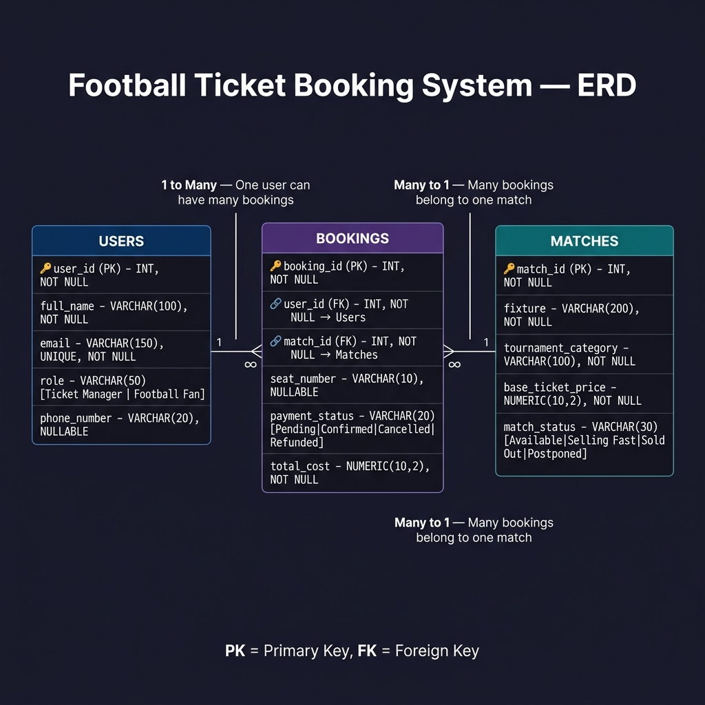

# Football Ticket Booking System — Assignment 3

## Project Structure

```
Assignment 3/
├── schema_and_data.sql   ← Table definitions (DDL) + sample data (DML)
├── QUERY.sql             ← All 7 SQL queries with expected output comments
├── ERD.png               ← Entity Relationship Diagram (Crow's Foot notation)
└── README.md             ← This file
```

---

## Part 1: ERD Design



### Relationships

| Relationship | Description |
|---|---|
| **1 → Many** | One `User` → Many `Bookings` (a fan can book tickets for multiple matches) |
| **Many → 1** | Many `Bookings` → One `Match` (a match can have thousands of booking records) |
| **1 → 1 (logical)** | Each booking row maps exactly one user to one match for a specific seat |

---

## Part 2: SQL Queries Summary

| # | Query | Key Concepts |
|---|---|---|
| 1 | Champions League — Available matches | `WHERE`, multiple conditions |
| 2 | Users named 'Tanvir' or containing 'Haque' | `ILIKE`, `LIKE` |
| 3 | Bookings with NULL payment status | `IS NULL`, `COALESCE` |
| 4 | Booking details with user name and fixture | `INNER JOIN` (two joins) |
| 5 | All users + their bookings (including no-booking fans) | `LEFT JOIN` |
| 6 | Bookings with cost above average | Scalar subquery, `AVG` |
| 7 | 2nd and 3rd most expensive matches | `ORDER BY`, `LIMIT`, `OFFSET` |

---

## How to Run

1. Open **pgAdmin** or any PostgreSQL client.
2. Create a new database (e.g., `football_booking`).
3. Run `schema_and_data.sql` first to create tables and insert sample data.
4. Run queries from `QUERY.sql` one by one.

---

## Database Schema

### Users
| Column | Type | Constraints |
|---|---|---|
| user_id | SERIAL | PK |
| full_name | VARCHAR(100) | NOT NULL |
| email | VARCHAR(150) | NOT NULL, UNIQUE |
| role | VARCHAR(50) | CHECK: Ticket Manager \| Football Fan |
| phone_number | VARCHAR(20) | NULLABLE |

### Matches
| Column | Type | Constraints |
|---|---|---|
| match_id | SERIAL | PK |
| fixture | VARCHAR(200) | NOT NULL |
| tournament_category | VARCHAR(100) | NOT NULL |
| base_ticket_price | NUMERIC(10,2) | NOT NULL |
| match_status | VARCHAR(30) | CHECK: Available \| Selling Fast \| Sold Out \| Postponed |

### Bookings
| Column | Type | Constraints |
|---|---|---|
| booking_id | SERIAL | PK |
| user_id | INT | FK → users(user_id) |
| match_id | INT | FK → matches(match_id) |
| seat_number | VARCHAR(10) | NULLABLE |
| payment_status | VARCHAR(20) | CHECK: Pending \| Confirmed \| Cancelled \| Refunded; NULLABLE |
| total_cost | NUMERIC(10,2) | NOT NULL |
